Okay, that's a comprehensive SDK you've built! It addresses many critical aspects needed for production-ready MCP servers. Based on the structure and your existing README, here are several detailed documentation documents in Markdown format.

These documents aim to provide the "nitty-gritty" details developers would need, expanding on your current README.

***

## Document 1: `README.md` (Revised)

*(This revises your existing README slightly to incorporate links to the more detailed documents)*

```markdown
# MCP Governance SDK (@ithena/mcp-governance)

[](https://www.npmjs.com/package/@ithena/mcp-governance)
[](https://opensource.org/licenses/MIT)
<!-- [](https://github.com/ithena-labs/mcp-governance/actions/workflows/ci.yml) -->
<!-- Add build status badge once CI is set up -->

**The missing governance layer for your Model Context Protocol (MCP) servers.**

Build secure, compliant, and observable MCP applications by easily adding **Identity, Authorization (RBAC), Credential Management, Auditing, Logging, and Tracing** to servers built with [`@modelcontextprotocol/sdk`](https://github.com/modelcontextprotocol/typescript-sdk).

---

**📄 Documentation:**

*   **[Getting Started](./GETTING_STARTED.md)**
*   **[Core Concepts](./CORE_CONCEPTS.md)**
*   **[Configuration](./CONFIGURATION.md)**
*   **[Interfaces (Extensibility)](./INTERFACES.md)**
*   **[Authorization (RBAC)](./AUTHORIZATION.md)**
*   **[Auditing & Logging](./AUDITING_LOGGING.md)**
*   **[Default Implementations](./DEFAULTS.md)**
*   **[Security Considerations](./SECURITY.md)**

---

## The Problem: Production MCP Needs More

The standard [`@modelcontextprotocol/sdk`](https://github.com/modelcontextprotocol/typescript-sdk) is excellent for implementing the core MCP communication protocol. However, deploying MCP servers in production, especially in enterprise environments, requires addressing critical governance questions:

*   ❓ **Who** is accessing data and tools? (Authentication)
*   🔒 Are they **allowed** to do that? (Authorization)
*   🔑 How do handlers securely access needed **secrets**? (Credentials)
*   📝 **What happened**? (Auditing & Compliance)
*   🩺 How do we **monitor and debug** effectively? (Logging & Tracing)

Implementing these consistently across every MCP server is complex and error-prone.

## The Solution: `@ithena/mcp-governance`

This SDK provides a standard, pluggable framework that wraps the base `Server` class, letting you integrate essential governance features without rewriting your core MCP logic.

**Benefits:**

*   ✅ **Standardize Governance:** Consistent handling of identity, permissions, secrets, and auditing.
*   🔒 **Enhance Security:** Enforce access controls and securely manage credentials.
*   📝 **Meet Compliance:** Generate detailed audit trails for regulatory requirements.
*   🧩 **Pluggable Architecture:** Integrate easily with your existing enterprise systems (IDPs, Secret Managers, SIEMs) via well-defined interfaces. (See **[Interfaces](./INTERFACES.md)**)
*   ⚙️ **Focus on Business Logic:** Let the SDK handle governance boilerplate, allowing your team to focus on building valuable MCP resources, tools, and prompts.
*   🚀 **Faster Development:** Get production-ready features out-of-the-box with sensible defaults for development and testing. (See **[Defaults](./DEFAULTS.md)**)

## Key Features

*   🆔 **Pluggable Identity Resolution** (`IdentityResolver`)
*   🛡️ **Flexible Role-Based Access Control** (`RoleStore`, `PermissionStore`)
*   🔑 **Secure Credential Injection** (`CredentialResolver`)
*   ✍️ **Comprehensive Auditing** (`AuditLogStore`)
*   🪵 **Structured, Request-Scoped Logging** (`Logger`)
*   🔗 **Trace Context Propagation** (W3C default via `TraceContextProvider`)
*   ⚙️ **Configurable Governance Pipeline** (See **[Core Concepts](./CORE_CONCEPTS.md)**)
*   📦 **Minimal Intrusion** (Wraps the base SDK `Server`)

## Architecture Overview

`@ithena/mcp-governance` intercepts incoming MCP requests and notifications, processing them through a defined pipeline before (or during) the execution of your business logic handlers.

```mermaid
graph LR
    A[MCP Request In] --> B(Context Setup: EventID, Logger, TraceContext);
    B --> C{IdentityResolver?};
    C -- Yes --> D[Resolve Identity];
    C -- No --> E[Identity = null];
    D --> E;
    E --> F{RBAC Enabled?};
    F -- No --> K[Credential Resolution];
    F -- Yes --> G{Identity Resolved?};
    G -- No --> H(DENY: Identity Required);
    G -- Yes --> I[Derive Permission];
    I --> J{Permission Check Needed?};
    J -- No (null permission) --> L{Post-Auth Hook?};
    J -- Yes --> J1[Get Roles];
    J1 --> J2[Check Permissions];
    J2 -- Denied --> H2(DENY: Insufficient Permission);
    J2 -- Granted --> L;
    L -- Yes --> M[Execute Hook];
    L -- No --> K;
    M --> K;
    K -- Yes (Resolver Exists) --> N[Resolve Credentials];
    K -- No --> O[Credentials = null/undefined];
    N -- Error & failOnError=true --> P(FAIL: Credentials Error);
    N -- Error & failOnError=false --> O;
    N -- Success --> O;
    O --> Q[Execute Governed Handler];
    Q -- Success --> R[Result];
    Q -- Error --> S(FAIL: Handler Error);
    R --> T(Send Response);
    S --> T;
    P --> T;
    H --> T;
    H2 --> T;
    T --> U(Audit Log);

    style H fill:#f99,stroke:#333,stroke-width:2px;
    style H2 fill:#f99,stroke:#333,stroke-width:2px;
    style P fill:#f99,stroke:#333,stroke-width:2px;
    style S fill:#f99,stroke:#333,stroke-width:2px;
    style U fill:#ccf,stroke:#333,stroke-width:1px,stroke-dasharray: 5 5;
```



See **[Core Concepts](./CORE_CONCEPTS.md)** for more details on the pipeline.

## Installation

```bash
npm install @ithena/mcp-governance @modelcontextprotocol/sdk zod
# or
yarn add @ithena/mcp-governance @modelcontextprotocol/sdk zod
# or
pnpm add @ithena/mcp-governance @modelcontextprotocol/sdk zod
```

**Peer Dependencies:** Make sure you have compatible versions of `@modelcontextprotocol/sdk` (check `peerDependencies` in `package.json`) and `zod` installed.

## Quick Start

See the **[Getting Started Guide](./GETTING_STARTED.md)** for a runnable example.

## Next Steps

*   Understand the **[Core Concepts](./CORE_CONCEPTS.md)** like `GovernedServer` and the pipeline.
*   Review the **[Configuration Options](./CONFIGURATION.md)** available.
*   Explore the **[Interfaces](./INTERFACES.md)** to integrate with your systems.
*   Learn about **[Authorization](./AUTHORIZATION.md)** and **[Auditing/Logging](./AUDITING_LOGGING.md)**.
*   Review the **[Security Considerations](./SECURITY.md)** carefully.

## Contributing

Contributions are welcome! Please open an issue or submit a pull request on the [GitHub repository](https://github.com/ithena-labs/mcp-governance). <!-- Update URL -->
```

---

## Document 2: `GETTING_STARTED.md`

```markdown
# Getting Started with MCP Governance SDK

This guide provides a basic example of how to wrap a standard `@modelcontextprotocol/sdk` `Server` with the `@ithena/mcp-governance` SDK to add identity, RBAC, logging, and auditing.

## Prerequisites

*   Node.js (version compatible with the SDKs)
*   A package manager (npm, yarn, or pnpm)

## Installation

First, install the necessary packages:

```bash
npm install @ithena/mcp-governance @modelcontextprotocol/sdk zod
# or
yarn add @ithena/mcp-governance @modelcontextprotocol/sdk zod
# or
pnpm add @ithena/mcp-governance @modelcontextprotocol/sdk zod
```

**Peer Dependencies:** Ensure you have compatible versions of `@modelcontextprotocol/sdk` and `zod` installed (check `peerDependencies` in `@ithena/mcp-governance`'s `package.json`).

## Example Code

This example demonstrates:

*   Creating a base MCP `Server`.
*   Setting up simple, **in-memory** governance components (Logger, Audit Store, Identity Resolver, RBAC Stores).
*   Wrapping the base server with `GovernedServer`.
*   Registering request handlers through the `GovernedServer`.
*   Connecting using `StdioServerTransport`.

```typescript
// main.ts
import { Server as BaseServer } from '@modelcontextprotocol/sdk/server';
import { StdioServerTransport } from '@modelcontextprotocol/sdk/server/stdio';
import { Request, Result, CallToolResult } from '@modelcontextprotocol/sdk/types'; // Import base types
import {
    GovernedServer,
    GovernedServerOptions,
    ConsoleLogger,           // Default structured logger
    ConsoleAuditLogStore,    // Default audit store (logs to console)
    InMemoryRoleStore,       // Default in-memory RBAC store
    InMemoryPermissionStore, // Default in-memory RBAC store
    IdentityResolver,        // Interface for identity
    OperationContext,
    UserIdentity,
    GovernedRequestHandlerExtra,
    defaultDerivePermission, // Default permission derivation logic
    defaultSanitizeForAudit  // Default audit sanitization logic
} from '@ithena/mcp-governance';
import { z } from 'zod'; // Peer dependency
import process from 'node:process';

// --- 1. Create Base MCP Server ---
// This is the standard server from @modelcontextprotocol/sdk
const baseServer = new BaseServer(
    { name: "MyGovernedServer", version: "1.0.0" },
    {
        // Base server capabilities (optional, governance SDK adds its own)
        capabilities: {
            tools: {},
            resources: {},
        }
    }
);

// --- 2. Configure Governance Components ---
// Use default console logger and auditor for demonstration
const logger = new ConsoleLogger({}, 'debug'); // Log debug messages and above
const auditStore = new ConsoleAuditLogStore();

// Configure RBAC (In-memory example - REPLACE FOR PRODUCTION)
// Map user IDs to roles
const roleStore = new InMemoryRoleStore({
    'user-admin': ['admin'],
    'user-viewer': ['viewer'],
});
// Map roles to permissions
const permissionStore = new InMemoryPermissionStore({
    'admin': ['tool:call:admin_tool', 'resource:read:*'], // Admins can call 'admin_tool' and read any resource
    'viewer': ['resource:read:public/*'], // Viewers can only read resources under 'public/'
});

// Simple Identity Resolver (Example: trusts a header - INSECURE FOR PRODUCTION)
// !! Replace with real authentication logic (JWT, OAuth introspection, etc.) !!
const identityResolver: IdentityResolver = {
    async resolveIdentity(opCtx: OperationContext): Promise<UserIdentity | null> {
        const userHeader = opCtx.transportContext.headers?.['x-user-id'];
        // Note: Headers might be arrays if sent multiple times
        const userId = Array.isArray(userHeader) ? userHeader[0] : userHeader;

        if (userId) {
            logger.debug(`Resolved identity: ${userId}`, { eventId: opCtx.eventId });
            // You could return a structured object too: return { id: userId, tenant: '...' };
            return userId;
        }
        logger.debug('No identity found in x-user-id header', { eventId: opCtx.eventId });
        return null; // Return null if no identity can be determined
    }
};

// --- 3. Create GovernedServer ---
// Wrap the base server and provide the configured components
const governedServerOptions: GovernedServerOptions = {
    logger: logger,
    auditStore: auditStore,
    identityResolver: identityResolver, // Provide the identity resolver
    roleStore: roleStore,             // Provide the role store
    permissionStore: permissionStore,   // Provide the permission store
    enableRbac: true,                 // IMPORTANT: Enable RBAC checks
    auditDeniedRequests: true,        // Log requests even if denied by RBAC
    auditNotifications: false,        // Don't audit notifications in this example
    serviceIdentifier: "my-mcp-service-instance-1", // Optional identifier for logs/audits
    // derivePermission: defaultDerivePermission, // Uses default logic if omitted
    // sanitizeForAudit: defaultSanitizeForAudit, // Uses default logic if omitted
};
const governedServer = new GovernedServer(baseServer, governedServerOptions);

// --- 4. Register Handlers via GovernedServer ---
// Use Zod schemas for automatic validation. Handlers receive GovernedRequestHandlerExtra.

// Zod schema for the admin tool request
const adminToolSchema = z.object({
    jsonrpc: z.literal("2.0"),
    id: z.union([z.string(), z.number()]),
    method: z.literal('tools/call'),
    params: z.object({
        name: z.literal('admin_tool'),
        arguments: z.any().optional(), // Define specific args if needed
        _meta: z.any().optional() // Allow _meta from base schema
    })
});

governedServer.setRequestHandler(adminToolSchema,
    async (request, extra: GovernedRequestHandlerExtra): Promise<CallToolResult> => {
        // Access identity, roles, logger, etc. from 'extra'
        extra.logger.info(`Executing admin_tool for identity: ${JSON.stringify(extra.identity)}`, { roles: extra.roles });

        // RBAC already checked 'tool:call:admin_tool' permission before calling this handler

        // Handler logic...
        return { content: [{ type: 'text', text: `Admin operation successful for ${extra.identity}` }] };
    }
);

// Zod schema for resource read requests
const resourceReadSchema = z.object({
    jsonrpc: z.literal("2.0"),
    id: z.union([z.string(), z.number()]),
    method: z.literal('resources/read'),
    params: z.object({
        uri: z.string(),
        _meta: z.any().optional() // Allow _meta from base schema
    })
});

governedServer.setRequestHandler(resourceReadSchema,
    async (request, extra: GovernedRequestHandlerExtra) => {
         extra.logger.info(`Reading resource ${request.params.uri}`, { identity: extra.identity, roles: extra.roles });

         // RBAC checked 'resource:read:<uri>' permission

         // Your resource fetching logic here...
         const content = `Content of ${request.params.uri} for user ${extra.identity}`;

        return { contents: [{ uri: request.params.uri, text: content }] };
     }
);

// --- 5. Connect Transport ---
// Use the appropriate transport for your server (Stdio, SSE, WebSocket)
const transport = new StdioServerTransport();

// Connect the GovernedServer (which internally connects the baseServer)
await governedServer.connect(transport);

logger.info("Governed MCP server started on stdio.");
logger.info("Connect with an MCP client and send requests.");
logger.info("Try sending with header 'x-user-id: user-admin' or 'x-user-id: user-viewer'");

// --- 6. Graceful Shutdown ---
const shutdown = async () => {
    logger.info("Shutting down...");
    try {
        await governedServer.close(); // Close the governed server
        logger.info("Shutdown complete.");
        process.exit(0);
    } catch (err) {
        logger.error("Error during shutdown:", err);
        process.exit(1);
    }
};
process.on('SIGINT', shutdown); // Handle Ctrl+C
process.on('SIGTERM', shutdown); // Handle kill signals
```

## Running the Example

1.  Save the code above as `main.ts`.
2.  Compile it: `tsc main.ts` (you might need `npm install -g typescript @types/node`).
3.  Run the server: `node main.js`.
4.  Connect using an MCP client (like a simple Node.js client using `StdioClientTransport` or Anthropic's example clients).

**Testing RBAC:**

*   Use an MCP client that allows setting headers.
*   **To act as admin:** Send a request with the header `x-user-id: user-admin`. Try calling `admin_tool` or reading `resource:read:secret/mysecret`.
*   **To act as viewer:** Send a request with the header `x-user-id: user-viewer`. Try reading `resource:read:public/data`. Try calling `admin_tool` (should be denied). Try reading `resource:read:secret/mysecret` (should be denied).
*   **To act anonymously:** Send a request without the `x-user-id` header. Try calling `admin_tool` (should be denied).

You should see corresponding log messages and audit records (if using `ConsoleAuditLogStore`) on the server console.

## Next Steps

*   Understand the **[Core Concepts](./CORE_CONCEPTS.md)**.
*   Review **[Configuration](./CONFIGURATION.md)** options.
*   Implement **production-ready** versions of the governance components, especially `IdentityResolver`, `RoleStore`, `PermissionStore`, and potentially `CredentialResolver` and `AuditLogStore`. See the **[Interfaces](./INTERFACES.md)** documentation.
*   Review the **[Security Considerations](./SECURITY.md)**.
```

---

## Document 3: `CORE_CONCEPTS.md`

```markdown
# Core Concepts

The `@ithena/mcp-governance` SDK introduces several key concepts built around the base `@modelcontextprotocol/sdk`.

## 1. `GovernedServer`

The `GovernedServer` is the main class you interact with. It acts as a **wrapper** around the standard MCP `Server` instance provided by `@modelcontextprotocol/sdk`.

*   **Purpose:** To orchestrate the governance pipeline and manage the lifecycle of governance components.
*   **Usage:**
    *   You instantiate it by passing a base `Server` instance and `GovernedServerOptions`.
    *   You register your MCP request and notification handlers (for tools, resources, prompts) directly with the `GovernedServer` instance, typically using Zod schemas for validation.
    *   You call `governedServer.connect(transport)` and `governedServer.close()` instead of calling these methods on the base `Server`.
*   **Lifecycle Management:** The `GovernedServer` uses the `LifecycleManager` internally to automatically call the optional `initialize()` method on your provided governance components (Logger, Stores, Resolvers) during `connect()` and the optional `shutdown()` method during `close()`.

## 2. Governance Pipeline

This is the sequence of steps executed by the `GovernedServer` for each incoming MCP request or notification. It allows for consistent application of governance controls.

**Request Pipeline Steps:**

1.  **Context Setup:** A unique `eventId` is generated. A request-scoped `Logger` (child logger if supported) and `TraceContext` (via `TraceContextProvider`) are created. An initial `OperationContext` and `AuditRecord` are prepared.
2.  **Identity Resolution:** If an `IdentityResolver` is configured, its `resolveIdentity` method is called to determine the `UserIdentity` of the caller. The identity is added to the `OperationContext` and `AuditRecord`. Failure here (and throwing an `AuthenticationError`) typically stops the pipeline.
3.  **RBAC (Authorization):** If `enableRbac` is true:
    *   Requires a resolved `UserIdentity`. Failure results in an `AuthorizationError`.
    *   `derivePermission` is called to get the permission string for the request (e.g., `tool:call:my_tool`).
    *   If a permission string is derived:
        *   The `RoleStore`'s `getRoles` method is called to fetch roles for the identity.
        *   The `PermissionStore`'s `hasPermission` method is checked for each role against the derived permission.
        *   If no role grants the permission, an `AuthorizationError` is thrown, stopping the pipeline.
    *   The authorization decision (`granted`, `denied`, `not_applicable`) and roles are added to the `AuditRecord`.
4.  **Post-Authorization Hook:** If configured (`postAuthorizationHook`), this asynchronous function is called *after* successful authorization (or if authorization was not applicable). It receives the resolved identity and the `OperationContext`. Failure here can optionally stop the pipeline.
5.  **Credential Resolution:** If a `CredentialResolver` is configured, its `resolveCredentials` method is called.
    *   It receives the resolved `identity` (or null) and the `OperationContext`.
    *   It should return the necessary secrets/credentials for the handler.
    *   If it fails and `failOnCredentialResolutionError` is true (default), a `CredentialResolutionError` is thrown, stopping the pipeline. If false, the error is logged, and the pipeline continues (handler receives null/undefined credentials).
    *   The outcome is added to the `AuditRecord`.
6.  **Execute Governed Handler:** The specific MCP handler (tool, resource, prompt) you registered with `GovernedServer` is executed.
    *   It receives the parsed request and `GovernedRequestHandlerExtra`, which includes the `logger`, `identity`, `roles`, `resolvedCredentials`, `traceContext`, `eventId`, etc.
    *   Errors thrown by the handler are wrapped in a `HandlerError`.
7.  **Auditing:** Regardless of success or failure, a final `AuditRecord` is assembled.
    *   The `sanitizeForAudit` function is called (if configured).
    *   If auditing is enabled for the outcome (e.g., success, failure, or denied based on `auditDeniedRequests`), the sanitized record is passed to the `AuditLogStore`'s `log` method. Auditing failures are logged but do not fail the original request.
8.  **Response/Error:** A successful result is sent back, or a mapped JSON-RPC error (based on errors caught during the pipeline) is sent.

**Notification Pipeline Steps:**

Notifications follow a simpler path, primarily focused on execution and auditing (if enabled):

1.  Context Setup (similar to requests).
2.  Identity Resolution (optional, primarily for logging/auditing context; failures typically don't stop the pipeline).
3.  Execute Governed Handler (if one is registered for the notification method). Handler errors are logged.
4.  Auditing (if `auditNotifications` is true).

*(Refer to the Mermaid diagram in `README.md` for a visual representation)*

## 3. `OperationContext`

This object aggregates context information about the current MCP operation (request or notification) and is passed to various governance components (`IdentityResolver`, `RoleStore`, `PermissionStore`, `CredentialResolver`, hooks).

**Key Properties:**

*   `eventId`: Unique ID for this operation lifecycle.
*   `timestamp`: Start time of processing.
*   `transportContext`: Information about the connection (type, headers, IP).
*   `traceContext`: Distributed tracing information (traceId, spanId).
*   `logger`: Request-scoped logger instance.
*   `mcpMessage`: The raw incoming MCP Request or Notification.
*   `serviceIdentifier`: Optional ID for the server instance.
*   `identity`: (Added by IdentityResolver) The resolved user identity.
*   `derivedPermission`: (Added during RBAC) The permission string being checked.
*   `roles`: (Added during RBAC) The roles associated with the identity.

## 4. `GovernedRequestHandlerExtra` / `GovernedNotificationHandlerExtra`

These objects extend the base SDK's `RequestHandlerExtra` and provide the enriched context directly to *your* MCP business logic handlers registered via `GovernedServer`.

**Key Properties (Request):**

*   `eventId`: Unique ID for this operation.
*   `logger`: Request-scoped logger.
*   `identity`: Resolved identity (or null).
*   `roles`: Resolved roles (if RBAC enabled).
*   `resolvedCredentials`: Credentials fetched by `CredentialResolver`.
*   `traceContext`: Distributed tracing info.
*   `transportContext`: Transport info.
*   `signal`: AbortSignal from the base SDK.
*   `sessionId`: Session ID from the transport.

## 5. Lifecycle Management (`LifecycleManager`)

This internal component handles the initialization and shutdown of governance components.

*   **Initialization (`initialize()`):** During `GovernedServer.connect()`, it iterates through all configured components (Logger, Stores, Resolvers) and calls their optional `initialize()` method *sequentially*. If any `initialize()` method throws an error, the connection process is aborted, and any already-initialized components have their `shutdown()` method called.
*   **Shutdown (`shutdown()`):** During `GovernedServer.close()`, it iterates through all *successfully initialized* components and calls their optional `shutdown()` method *in parallel*. Errors during shutdown are logged but do not prevent other components from shutting down or the server from closing.
```

---

## Document 4: `CONFIGURATION.md`

```markdown
# Configuration Options (`GovernedServerOptions`)

You configure the behavior of the `@ithena/mcp-governance` SDK by passing an options object to the `GovernedServer` constructor.

```typescript
import { GovernedServer, GovernedServerOptions } from '@ithena/mcp-governance';
import { Server as BaseServer } from '@modelcontextprotocol/sdk/server';

const baseServer = new BaseServer({ name: "MyServer", version: "1.0" });

const options: GovernedServerOptions = {
    // ... your configuration options ...
    logger: myCustomLogger,
    identityResolver: myIdentityResolver,
    enableRbac: true,
    // ... etc
};

const governedServer = new GovernedServer(baseServer, options);
```

Below are the available options:

| Option                          | Type                                                            | Default                     | Description                                                                                                                               | Required For |
| :------------------------------ | :-------------------------------------------------------------- | :-------------------------- | :---------------------------------------------------------------------------------------------------------------------------------------- | :----------- |
| `identityResolver`              | `IdentityResolver`                                              | `undefined`                 | Your implementation to resolve the caller's identity from the request context (e.g., headers, tokens). See **[Interfaces](./INTERFACES.md#identityresolver)**. | RBAC         |
| `roleStore`                     | `RoleStore`                                                     | `undefined`                 | Your implementation to fetch the roles associated with a resolved identity. See **[Interfaces](./INTERFACES.md#rolestore)**.                  | RBAC         |
| `permissionStore`               | `PermissionStore`                                               | `undefined`                 | Your implementation to check if a role grants a specific permission string. See **[Interfaces](./INTERFACES.md#permissionstore)**.       | RBAC         |
| `credentialResolver`            | `CredentialResolver`                                            | `undefined`                 | Your implementation to securely fetch credentials (secrets, API keys) needed by handlers. See **[Interfaces](./INTERFACES.md#credentialresolver)**. | -            |
| `auditStore`                    | `AuditLogStore`                                                 | `NoOpAuditLogStore`         | Your implementation to log detailed audit records. Defaults to doing nothing. See **[Interfaces](./INTERFACES.md#auditlogstore)**.            | Auditing     |
| `logger`                        | `Logger`                                                        | `ConsoleLogger`             | A structured logger instance. Defaults to logging JSON to the console. See **[Interfaces](./INTERFACES.md#logger)**.                      | Logging      |
| `traceContextProvider`          | `TraceContextProvider`                                          | `defaultTraceContextProvider` | Extracts distributed tracing context (e.g., W3C `traceparent`). Defaults to checking headers. See **[Interfaces](./INTERFACES.md#tracecontextprovider)**. | Tracing      |
| `enableRbac`                    | `boolean`                                                       | `false`                     | Set to `true` to activate the RBAC checks in the pipeline. Requires `identityResolver`, `roleStore`, and `permissionStore` to be provided. | RBAC         |
| `failOnCredentialResolutionError` | `boolean`                                                       | `true`                      | If `true`, requests will fail if the `credentialResolver` throws an error. If `false`, errors are logged, and the pipeline continues.       | -            |
| `auditDeniedRequests`           | `boolean`                                                       | `true`                      | If `true`, audit records are generated and sent to the `auditStore` even for requests that were denied by RBAC.                         | Auditing     |
| `auditNotifications`            | `boolean`                                                       | `false`                     | If `true`, audit records are generated and sent to the `auditStore` for incoming MCP notifications. Requires `auditStore` and `sanitizeForAudit`. | Auditing     |
| `derivePermission`              | `(req: Request, transportCtx: TransportContext) => string \| null` | `defaultDerivePermission`   | A function that generates the permission string (e.g., `tool:call:my_tool`) needed for a specific request. Return `null` to skip the permission check for that request. See **[Authorization](./AUTHORIZATION.md)**. | RBAC         |
| `sanitizeForAudit`              | `(record: AuditRecord) => AuditRecord`                          | `defaultSanitizeForAudit`   | **CRITICAL:** A function to remove or mask sensitive data (PII, secrets) from the `AuditRecord` before it's logged. **Review the default implementation carefully.** See **[Auditing & Logging](./AUDITING_LOGGING.md)**. | Auditing     |
| `postAuthorizationHook`         | `(identity: UserIdentity, opCtx: OperationContext) => Promise<void>` | `undefined`                 | An optional asynchronous function called after a request passes authorization checks (or if RBAC is disabled/not applicable). Can be used for secondary checks or setup based on identity. | -            |
| `serviceIdentifier`             | `string`                                                        | `undefined`                 | An optional string identifying this specific instance of your MCP server. Included in logs and audit records for easier correlation.       | -            |

**Important Notes:**

*   If `enableRbac` is `true`, you **must** provide implementations for `identityResolver`, `roleStore`, and `permissionStore`. Failure to do so will result in an error during `GovernedServer` instantiation.
*   Effective auditing requires providing an `auditStore` and carefully reviewing/customizing `sanitizeForAudit`.
*   Replace default in-memory stores and basic resolvers/loggers with production-grade implementations. See **[Defaults](./DEFAULTS.md)** and **[Security](./SECURITY.md)**.
```

---

## Document 5: `INTERFACES.md`

```markdown
# Interfaces for Extensibility

The `@ithena/mcp-governance` SDK is designed to be pluggable. You integrate it with your existing infrastructure (Identity Providers, Secret Managers, Logging/Auditing systems) by implementing these core interfaces and providing them in the `GovernedServerOptions`.

## `IdentityResolver`

*   **File:** `src/interfaces/identity.ts`
*   **Purpose:** Determines the identity of the user or system making the MCP request. This is the foundation for authentication and authorization.
*   **Methods:**
    *   `initialize?(): Promise<void>`: (Optional) Called once during `GovernedServer.connect()`. Use for setup like initializing SDKs or warming caches. Throw an error to abort connection.
    *   `resolveIdentity(opCtx: OperationContext): Promise<UserIdentity | null>`:
        *   **Required.** Called for every request (and optionally for notifications).
        *   Examine `opCtx.transportContext` (e.g., `headers`, `remoteAddress`) and potentially `opCtx.mcpMessage` to extract authentication credentials (like JWT from `Authorization` header, API key, session cookie, mTLS certificate info, etc.).
        *   Validate the credentials against your identity provider or system.
        *   Return a `UserIdentity` (string or object with `id`) upon successful authentication.
        *   Return `null` if no identity can be determined (anonymous access, if allowed).
        *   Throw an `AuthenticationError` (or a subclass) if authentication fails (e.g., invalid token, bad password). This usually stops the request pipeline.
    *   `shutdown?(): Promise<void>`: (Optional) Called once during `GovernedServer.close()`. Use for cleanup like closing connections. Should not throw errors.
*   **Implementation Notes:** This is a critical security component. Ensure robust validation of credentials. Common patterns include validating JWTs, introspecting OAuth tokens, or verifying API keys against a database. **Never trust headers like `X-User-ID` directly in production without validation.**

## `RoleStore`

*   **File:** `src/interfaces/rbac.ts`
*   **Purpose:** Retrieves the list of roles associated with a successfully resolved identity. Required if `enableRbac` is true.
*   **Methods:**
    *   `initialize?(): Promise<void>`: (Optional) Setup logic.
    *   `getRoles(identity: UserIdentity, opCtx: OperationContext): Promise<string[]>`:
        *   **Required if RBAC enabled.** Called after identity resolution.
        *   Takes the `UserIdentity` returned by `IdentityResolver`.
        *   Query your authorization system (e.g., LDAP groups, database table, IDP claims) to find the roles assigned to this identity.
        *   Return an array of role strings (e.g., `['admin', 'editor']`). Return an empty array `[]` if the user has no roles.
    *   `shutdown?(): Promise<void>`: (Optional) Cleanup logic.
*   **Implementation Notes:** Map the `UserIdentity` to roles defined in your system.

## `PermissionStore`

*   **File:** `src/interfaces/rbac.ts`
*   **Purpose:** Checks if a given role possesses a specific permission required for an operation. Required if `enableRbac` is true.
*   **Methods:**
    *   `initialize?(): Promise<void>`: (Optional) Setup logic.
    *   `hasPermission(role: string, permission: string, opCtx: OperationContext): Promise<boolean>`:
        *   **Required if RBAC enabled.** Called during RBAC checks for each role the user has.
        *   `role`: A single role string from the list returned by `RoleStore`.
        *   `permission`: The permission string generated by `derivePermission` (e.g., `tool:call:my_tool`).
        *   Check if the specified `role` grants the specified `permission` according to your system's rules (e.g., check a permissions database, policy engine).
        *   Return `true` if the permission is granted, `false` otherwise.
    *   `shutdown?(): Promise<void>`: (Optional) Cleanup logic.
*   **Implementation Notes:** Can implement simple role-to-permission mapping or integrate with more complex policy engines (like OPA). Consider supporting wildcards (e.g., `resource:read:*`) if needed.

## `CredentialResolver`

*   **File:** `src/interfaces/credentials.ts`
*   **Purpose:** Securely fetches sensitive credentials (API keys, tokens, passwords) that your MCP handlers (tools, resources) might need to interact with other systems.
*   **Methods:**
    *   `initialize?(): Promise<void>`: (Optional) Setup logic (e.g., connect to secrets manager).
    *   `resolveCredentials(identity: UserIdentity | null, opCtx: OperationContext): Promise<ResolvedCredentials | null | undefined>`:
        *   **Optional.** Called after successful authorization (if RBAC is enabled) or after identity resolution (if RBAC is disabled).
        *   Receives the resolved `identity` (or null) and the `OperationContext`.
        *   Determine which credentials are needed based on the operation (`opCtx.mcpMessage`) or the user (`identity`).
        *   Fetch secrets securely from your secrets management system (e.g., HashiCorp Vault, AWS Secrets Manager, Azure Key Vault). **Avoid hardcoding secrets.**
        *   Return a `ResolvedCredentials` object (a `Record<string, any>`) containing the fetched secrets.
        *   Return `null` or `undefined` if no credentials are required for this operation/identity.
        *   Throw a `CredentialResolutionError` if required credentials cannot be fetched. This may fail the request depending on the `failOnCredentialResolutionError` option.
    *   `shutdown?(): Promise<void>`: (Optional) Cleanup logic (e.g., close connection to secrets manager).
*   **Implementation Notes:** Focus on secure retrieval and avoid exposing secrets unnecessarily. The returned credentials object is passed directly to your handler via `GovernedRequestHandlerExtra`.

## `AuditLogStore`

*   **File:** `src/interfaces/audit.ts`
*   **Purpose:** Receives detailed audit records for storage and analysis, typically in a SIEM, database, or log aggregation platform.
*   **Methods:**
    *   `initialize?(): Promise<void>`: (Optional) Setup logic (e.g., establish connection to logging platform).
    *   `log(record: AuditRecord): Promise<void>`:
        *   **Required for Auditing.** Called asynchronously at the end of the pipeline.
        *   Receives the complete, potentially *sanitized* `AuditRecord`.
        *   Implement logic to send this record to your auditing system (e.g., Splunk, Elasticsearch, database).
        *   **Important:** This method should handle its own errors gracefully (e.g., log to console) and *not* throw errors that would disrupt the main MCP request flow.
    *   `shutdown?(): Promise<void>`: (Optional) Cleanup logic (e.g., flush buffered logs, close connections).
*   **Implementation Notes:** Implementations need to handle potential serialization issues and network failures when sending records. Consider batching or asynchronous sending for performance.

## `Logger`

*   **File:** `src/interfaces/logger.ts`
*   **Purpose:** Provides a standard interface for structured logging throughout the SDK and in your handlers.
*   **Methods:**
    *   `initialize?(): Promise<void>`: (Optional) Setup logic.
    *   `debug(message: string, context?: LogContext): void`
    *   `info(message: string, context?: LogContext): void`
    *   `warn(message: string, context?: LogContext): void`
    *   `error(message: string, error?: Error | unknown, context?: LogContext): void`
    *   `child?(bindings: LogContext): Logger`: (Optional but Recommended) Creates a new logger instance with additional context bound to it (e.g., `eventId`, `traceId`). Used by the SDK to create request-scoped loggers. If not provided, the same logger instance is used everywhere.
    *   `shutdown?(): Promise<void>`: (Optional) Cleanup logic (e.g., flush buffers).
*   **Implementation Notes:** Adapt your preferred Node.js logger (Pino, Winston, Bunyan) to this interface. Structured logging (using the `context` object) is highly recommended for better observability.

## `TraceContextProvider`

*   **File:** `src/interfaces/tracing.ts`
*   **Purpose:** Extracts distributed tracing information (like Trace IDs and Span IDs) from the incoming request context.
*   **Type:** A function type: `(transportContext: TransportContext, mcpMessage: Request | Notification) => TraceContext | undefined`
*   **Implementation Notes:** The default implementation (`defaultTraceContextProvider`) handles standard W3C Trace Context headers (`traceparent`, `tracestate`). Provide your own function if you use a different context propagation mechanism (e.g., B3 headers). The returned `TraceContext` is added to `OperationContext` and `AuditRecord`.
```

---

## Document 6: `DEFAULTS.md`

```markdown
# Default Implementations

The `@ithena/mcp-governance` SDK provides several default implementations for its core interfaces. These are primarily intended for **rapid development, testing, and demonstration purposes.**

**⚠️ IMPORTANT: Most default implementations are NOT suitable for production environments and should be replaced with robust, secure alternatives integrated with your infrastructure.**

## Default Logger (`ConsoleLogger`)

*   **Interface:** `Logger`
*   **File:** `src/defaults/logger.ts`
*   **Behavior:** Logs structured JSON messages to the `console`. Supports basic log levels (`debug`, `info`, `warn`, `error`) and creating child loggers with bound context.
*   **Production Readiness:** **NO.** Suitable for development and debugging only. Replace with an adapter for your production logging library (e.g., Pino, Winston) that sends logs to a proper aggregation system.

## Default Audit Stores (`NoOpAuditLogStore`, `ConsoleAuditLogStore`)

*   **Interface:** `AuditLogStore`
*   **File:** `src/defaults/audit.ts`
*   **Behavior:**
    *   `NoOpAuditLogStore` (Default if `auditStore` option is omitted): Does absolutely nothing. Auditing is effectively disabled.
    *   `ConsoleAuditLogStore`: Logs the complete, sanitized `AuditRecord` as JSON to the `console`.
*   **Production Readiness:** **NO.** `NoOpAuditLogStore` provides no auditing. `ConsoleAuditLogStore` is only suitable for basic debugging. Replace with an implementation that sends audit records to your SIEM, log aggregation platform (e.g., ELK, Splunk, Datadog), or a dedicated audit database.

## Default RBAC Stores (`InMemoryRoleStore`, `InMemoryPermissionStore`)

*   **Interface:** `RoleStore`, `PermissionStore`
*   **File:** `src/defaults/permissions.ts`
*   **Behavior:** Provide simple, in-memory storage for user-to-role and role-to-permission mappings, configured via constructor arguments. `InMemoryPermissionStore` supports a basic wildcard (`*`) for granting all permissions to a role.
*   **Production Readiness:** **NO.** These stores are volatile (data is lost on restart) and not scalable. Replace with implementations that query your actual authorization systems (e.g., LDAP/Active Directory groups, database tables, IDP role claims, dedicated policy engine).

## Default Permission Derivation (`defaultDerivePermission`)

*   **Interface:** `GovernedServerOptions['derivePermission']`
*   **File:** `src/defaults/permissions.ts`
*   **Behavior:** Generates basic permission strings based on the MCP request method and some parameters. Examples:
    *   `tools/call` -> `tool:call:<tool_name>`
    *   `resources/read` -> `resource:read:<uri>`
    *   `resources/list` -> `resource:list`
    *   `prompts/get` -> `prompt:get:<prompt_name>`
    *   Returns `null` for protocol messages like `initialize`, `ping` (skipping permission checks).
*   **Production Readiness:** **Maybe.** This provides a reasonable starting point, but you might need more granular permissions based on specific parameters or context. Review the generated strings and customize the function if necessary to match your authorization model. See **[Authorization](./AUTHORIZATION.md)**.

## Default Audit Sanitization (`defaultSanitizeForAudit`)

*   **Interface:** `GovernedServerOptions['sanitizeForAudit']`
*   **File:** `src/defaults/sanitization.ts`
*   **Behavior:** Attempts to mask common credential patterns (keywords like `key`, `token`, `secret`, `password`; `Bearer` tokens) and truncates very long string values within the `AuditRecord` before it's logged. It checks headers, MCP parameters, results, identity objects, and error details.
*   **Production Readiness:** **NEEDS REVIEW.** This is a **critical security function**. The default patterns are generic and might **miss sensitive data specific to your domain** or **incorrectly mask non-sensitive data**. You **MUST** review this function's behavior with your actual data and likely customize it significantly to ensure PII, business secrets, and other confidential information are properly redacted before logging. See **[Auditing & Logging](./AUDITING_LOGGING.md)** and **[Security](./SECURITY.md)**.

## Default Trace Context Provider (`defaultTraceContextProvider`)

*   **Interface:** `TraceContextProvider`
*   **File:** `src/defaults/tracing.ts`
*   **Behavior:** Extracts trace context information from standard W3C Trace Context HTTP headers (`traceparent`, `tracestate`) found in `transportContext.headers`.
*   **Production Readiness:** **Yes, if using W3C Trace Context.** If your systems use W3C Trace Context for distributed tracing, this default should work well. If you use a different propagation format (e.g., B3), provide a custom `TraceContextProvider` function.
```

---

## Document 7: `AUDITING_LOGGING.md`

```markdown
# Auditing and Logging

The `@ithena/mcp-governance` SDK provides robust mechanisms for observing the behavior of your MCP server through auditing and structured logging.

## Auditing

Auditing creates a detailed, structured record of each significant operation (primarily requests, optionally notifications) processed by the `GovernedServer`. This is crucial for security monitoring, compliance, and debugging.

**Key Components:**

1.  **`AuditRecord` (Type):** (`src/types.ts`) Defines the structure of the data captured for each audit event. Key fields include:
    *   `eventId`: Unique identifier for the operation.
    *   `timestamp`: When the operation completed (ISO 8601).
    *   `serviceIdentifier`: Optional ID of your server instance.
    *   `transport`: Details about the connection (`transportType`, `headers`, `remoteAddress`, `sessionId`).
    *   `mcp`: Details about the MCP message (`type`, `method`, `id`, `params`).
    *   `identity`: The resolved user identity (potentially sanitized).
    *   `trace`: Distributed tracing context (`traceId`, `spanId`, etc.).
    *   `outcome`: The final result of the operation:
        *   `status`: `'success'`, `'failure'`, or `'denied'`.
        *   `error?`: Details about any error that occurred (type, message, code, details).
        *   `mcpResponse?`: The result or error payload sent back to the client (for requests).
    *   `authorization?`: Details of the RBAC check (permission attempted, roles, decision).
    *   `credentialResolution?`: Outcome of the credential fetching step.
    *   `durationMs`: Total processing time.

2.  **`AuditLogStore` (Interface):** (`src/interfaces/audit.ts`) Your implementation receives `AuditRecord` objects and sends them to your chosen storage/analysis system (SIEM, database, log aggregator).
    *   Requires implementing the `log(record: AuditRecord): Promise<void>` method. This method **must handle its own errors** and should not throw, as it's called asynchronously after the request completes.
    *   Defaults: `NoOpAuditLogStore` (disables auditing), `ConsoleAuditLogStore` (logs JSON to console - **for development only**).

3.  **`sanitizeForAudit` (Configuration Option):** (`GovernedServerOptions`) A function you provide to process the `AuditRecord` *before* it's sent to the `AuditLogStore`.
    *   **Purpose:** To remove or mask sensitive information (PII, secrets, proprietary data) to prevent it from being persisted in audit logs.
    *   **Default (`defaultSanitizeForAudit`):** Provides basic masking for common patterns (keywords like `token`, `password`, `secret`; `Bearer` tokens) and truncates long strings.
    *   **⚠️ CRITICAL:** The default sanitizer is **insufficient** for most production systems. You **MUST** review its behavior and **customize it** to redact sensitive data specific to your application's parameters, results, identity objects, and error details. Failure to do so can lead to severe security vulnerabilities and compliance violations.

4.  **Configuration Options:**
    *   `auditStore`: Provide your `AuditLogStore` implementation.
    *   `sanitizeForAudit`: Provide your custom sanitization function.
    *   `auditDeniedRequests` (default `true`): Log audits even if RBAC denied the request.
    *   `auditNotifications` (default `false`): Log audits for incoming notifications (requires `auditStore` and `sanitizeForAudit`).

## Structured Logging

The SDK uses a structured logging approach, allowing you to capture log messages with associated context (like `eventId`, `traceId`, `userId`).

**Key Components:**

1.  **`Logger` (Interface):** (`src/interfaces/logger.ts`) Defines the standard logging methods (`debug`, `info`, `warn`, `error`).
    *   Accepts an optional `context` object for structured data.
    *   The `error` method accepts an optional `Error` object.
    *   The optional `child(bindings: LogContext): Logger` method is used by the SDK to create request-scoped loggers, automatically adding context like `eventId`, `requestId`, `method`, `traceId`, etc., to every message logged during that request's lifecycle.

2.  **`ConsoleLogger` (Default):** (`src/defaults/logger.ts`) A basic implementation that logs JSON objects to the console, including any provided context. Supports creating child loggers. **Suitable for development only.**

3.  **Usage:**
    *   Provide your `Logger` implementation via the `logger` option in `GovernedServerOptions`.
    *   The SDK automatically creates request-scoped loggers and passes them to:
        *   Governance components (via `OperationContext.logger`).
        *   Your MCP handlers (via `GovernedRequestHandlerExtra.logger` / `GovernedNotificationHandlerExtra.logger`).
    *   Use the provided logger instance within your components and handlers to emit logs with consistent context.

    ```typescript
    // Example within a request handler
    governedServer.setRequestHandler(mySchema,
        async (request, extra) => {
            extra.logger.info("Handler started", { customData: "value" });
            try {
                // ... handler logic ...
                extra.logger.debug("Intermediate step successful");
                return { success: true };
            } catch (err) {
                extra.logger.error("Handler failed", err, { input: request.params });
                throw err; // Re-throw for pipeline error handling
            }
        }
    );
    ```

4.  **Integration:** Create an adapter for your preferred Node.js logging library (e.g., Pino, Winston, Bunyan) that implements the `Logger` interface. Ensure your adapter correctly implements the `child` method if you want request-scoped logging context.

## Tracing

The SDK facilitates distributed tracing by extracting trace context information.

1.  **`TraceContext` (Type):** (`src/types.ts`) Holds standard tracing identifiers (e.g., `traceId`, `spanId`, `traceFlags`, `traceState`).
2.  **`TraceContextProvider` (Type):** (`src/interfaces/tracing.ts`) A function signature `(transportContext, mcpMessage) => TraceContext | undefined`.
3.  **`defaultTraceContextProvider` (Default):** (`src/defaults/tracing.ts`) Implements `TraceContextProvider` by looking for W3C Trace Context headers (`traceparent`, `tracestate`) in `transportContext.headers`.
4.  **Usage:**
    *   The `GovernedServer` calls the configured `traceContextProvider` at the start of the pipeline.
    *   The resulting `TraceContext` is added to:
        *   `OperationContext` (passed to governance components).
        *   `GovernedRequestHandlerExtra` / `GovernedNotificationHandlerExtra` (passed to your handlers).
        *   `AuditRecord`.
        *   The request-scoped `Logger`'s context (if the logger supports `child`).
    *   Use this context to correlate logs and traces across different services. Provide a custom provider if you use a different propagation standard.
```

---

## Document 8: `AUTHORIZATION.md`

```markdown
# Authorization (RBAC)

The `@ithena/mcp-governance` SDK provides a flexible Role-Based Access Control (RBAC) system integrated into its processing pipeline.

## Enabling RBAC

To enable authorization checks, set the `enableRbac` option to `true` in the `GovernedServerOptions`.

```typescript
const options: GovernedServerOptions = {
    // ... other options
    enableRbac: true,
    identityResolver: myIdentityResolver, // REQUIRED for RBAC
    roleStore: myRoleStore,             // REQUIRED for RBAC
    permissionStore: myPermissionStore,   // REQUIRED for RBAC
    // derivePermission: myPermissionDeriver, // Optional: Defaults work often
};

const governedServer = new GovernedServer(baseServer, options);
```

When `enableRbac` is `true`, you **must** provide implementations for `identityResolver`, `roleStore`, and `permissionStore`.

## RBAC Pipeline Steps

When RBAC is enabled, the following steps occur during the request pipeline (after Identity Resolution):

1.  **Check Identity:** If the `IdentityResolver` did not return a `UserIdentity` (i.e., returned `null`), an `AuthorizationError` with `reason: 'identity'` is thrown, and the request is denied. Anonymous access is generally not permitted when RBAC is enabled unless specific permissions bypass checks (see step 3).
2.  **Derive Permission:** The `derivePermission` function (either the default or your custom one) is called with the incoming MCP `Request` and `TransportContext`. It should return a string representing the permission required for this specific operation (e.g., `tool:call:admin_tool`, `resource:read:confidential/*`) or `null` if no permission check is needed for this request (e.g., for `ping`).
3.  **Check Necessity:** If `derivePermission` returns `null`, the RBAC check is skipped for this request, and the pipeline proceeds to the next step (Post-Authorization Hook or Credential Resolution).
4.  **Get Roles:** If a permission string *is* returned, the `RoleStore.getRoles(identity, opCtx)` method is called to fetch the list of roles associated with the resolved `UserIdentity`.
5.  **Check Permissions:** For each role returned by the `RoleStore`, the `PermissionStore.hasPermission(role, permission, opCtx)` method is called.
6.  **Grant/Deny:** If *any* of the user's roles grant the required permission (i.e., `hasPermission` returns `true` for at least one role), access is granted, and the pipeline proceeds. If *none* of the roles grant the permission, an `AuthorizationError` with `reason: 'permission'` is thrown, and the request is denied.

*(See **[Core Concepts](./CORE_CONCEPTS.md)** for the full pipeline diagram)*

## Components

*   **`IdentityResolver`:** (See **[Interfaces](./INTERFACES.md#identityresolver)**) Must successfully resolve a non-null `UserIdentity` for RBAC checks to proceed.
*   **`RoleStore`:** (See **[Interfaces](./INTERFACES.md#rolestore)**) Maps a `UserIdentity` to a list of role strings (`string[]`).
*   **`PermissionStore`:** (See **[Interfaces](./INTERFACES.md#permissionstore)**) Determines if a specific `role` string grants a specific `permission` string.

## Permission Strings

Permissions are simple strings used to represent the action being performed. The `derivePermission` function is responsible for generating these strings.

*   **Default Logic (`defaultDerivePermission`):** The default implementation generates permissions based on the MCP method and some key parameters. Examples:
    *   `tools/call` with `name: 'cleanup'` -> `"tool:call:cleanup"`
    *   `resources/read` with `uri: 'db://orders/123'` -> `"resource:read:db://orders/123"`
    *   `resources/list` -> `"resource:list"`
    *   `prompts/get` with `name: 'summary'` -> `"prompt:get:summary"`
    *   `completion/complete` with prompt ref -> `"completion:prompt:<prompt_name>:<arg_name>"`
    *   `initialize`, `ping` -> `null` (no check needed)
*   **Custom Logic:** You can provide your own `derivePermission` function in `GovernedServerOptions` if the default logic doesn't fit your needs or if you require more granularity based on request parameters or transport context.

```typescript
// Example Custom derivePermission
function myDerivePermission(request: Request, transportCtx: TransportContext): string | null {
    if (request.method === 'tools/call') {
        const toolName = request.params?.name;
        // Add extra check based on IP for a specific tool
        if (toolName === 'internal_admin_tool' && transportCtx.remoteAddress !== '192.168.1.10') {
             // Let PermissionStore handle the actual grant/deny based on role,
             // but derive a specific permission for internal access.
             return `internal:tool:call:${toolName}`;
        }
        // Fallback to default-like logic for other tools
        return toolName ? `tool:call:${toolName}` : null;
    }
    // Use default for other methods (or add more custom logic)
    return defaultDerivePermission(request, transportCtx);
}

const options: GovernedServerOptions = {
    // ...
    enableRbac: true,
    derivePermission: myDerivePermission,
    // ... other RBAC stores
};
```

## Error Handling

*   **`AuthenticationError`:** Thrown by `IdentityResolver` on failed authentication. Results in a `4xx` range error response (often mapped to MCP `InvalidRequest` or a custom code).
*   **`AuthorizationError`:** Thrown by the pipeline if identity is missing (`reason: 'identity'`) or if no role grants the required permission (`reason: 'permission'`). Results in a `4xx` range error response (often mapped to a custom `-32001` code or similar).

## Denied Request Auditing

By default (`auditDeniedRequests: true`), even requests denied by RBAC are logged by the `AuditLogStore`. The `AuditRecord.outcome.status` will be `'denied'`, and `AuditRecord.outcome.error` and `AuditRecord.authorization` will contain details about the denial. Set `auditDeniedRequests: false` to suppress these audit logs.
```

---

## Document 9: `SECURITY.md`

```markdown
# Security Considerations

The `@ithena/mcp-governance` SDK provides a framework for adding security and governance controls, but the overall security of your MCP server heavily depends on how you implement and configure its components. Please review these points carefully.

## 1. Authentication (`IdentityResolver`)

*   **SDK Role:** This SDK **facilitates** the use of identity but **does not perform authentication itself.**
*   **Your Responsibility:** Your `IdentityResolver` implementation is responsible for securely verifying the caller's identity based on credentials presented via the transport layer (e.g., HTTP headers, WebSocket context).
*   **Common Pitfalls:**
    *   **NEVER trust unvalidated headers** like `X-User-ID` or `X-API-Key` in production. Always validate tokens (JWT signature/expiry/issuer/audience), API keys (against a secure store), or session identifiers provided by a trusted authentication middleware/gateway.
    *   Ensure robust error handling during validation to prevent information leakage.
    *   Protect the communication channel (use TLS/HTTPS/WSS).
*   **Recommendations:** Integrate with standard authentication mechanisms like OAuth 2.0 / OpenID Connect (validating Bearer tokens), SAML, or use an API Gateway that handles authentication before forwarding requests to your MCP server.

## 2. Authorization (`RoleStore`, `PermissionStore`, `derivePermission`)

*   **Principle of Least Privilege:** Design your roles and permissions to grant only the minimum access necessary for users or systems to perform their tasks.
*   **Implementation Security:** Ensure your `RoleStore` and `PermissionStore` implementations securely fetch data and correctly enforce your access control rules. Protect the underlying data stores (databases, LDAP, etc.).
*   **Permission Granularity:** Review the `defaultDerivePermission` logic. If it's too coarse (e.g., `resource:read:*` grants too much), implement a custom `derivePermission` function that generates more specific permission strings based on request parameters (e.g., `resource:read:user_data/{userId}`). Be careful to validate parameters used in permission derivation.
*   **Complexity:** Complex authorization logic can be hard to reason about. Consider using established authorization models or integrating with dedicated policy engines (like Open Policy Agent - OPA) via your `PermissionStore`.

## 3. Credential Management (`CredentialResolver`)

*   **NEVER Hardcode Secrets:** Do not embed API keys, passwords, or other secrets directly in your code or configuration files.
*   **Secure Storage:** Your `CredentialResolver` must retrieve secrets from a secure, managed secrets store (e.g., HashiCorp Vault, AWS Secrets Manager, Azure Key Vault, GCP Secret Manager).
*   **Least Privilege:** Ensure the MCP server process itself has only the minimum necessary permissions to access the required secrets from the secrets manager.
*   **Rotation:** Implement regular rotation of secrets fetched by the `CredentialResolver`.
*   **Contextual Fetching:** Fetch credentials based on the specific needs of the operation (`opCtx.mcpMessage`) and potentially the identity (`identity`) to limit exposure.

## 4. Auditing and Logging (`AuditLogStore`, `Logger`, `sanitizeForAudit`)

*   **⚠️ Audit Sanitization is CRITICAL:** The most significant security risk with auditing is **logging sensitive data**.
    *   The `defaultSanitizeForAudit` provides **basic masking** but is likely **insufficient**. It may miss sensitive data specific to your application's request parameters, results, error details, or identity objects (e.g., PII like names, emails, addresses; financial data; proprietary business information; internal hostnames/IPs). It may also incorrectly mask non-sensitive data.
    *   **You MUST thoroughly review `defaultSanitizeForAudit` and implement a custom function tailored to your specific data structures and sensitivity requirements.**
    *   Test your sanitization logic rigorously with realistic data, including edge cases and error responses.
*   **Audit Log Storage:** Secure the storage location of your audit logs. Implement appropriate access controls and retention policies according to compliance requirements.
*   **Logging Sensitivity:** Be mindful of what you log via the `Logger`, even outside of formal auditing. Avoid logging full request/response payloads or sensitive data unless absolutely necessary and properly sanitized/masked. Use structured logging context wisely.

## 5. Input Validation

*   **Handler Schemas:** Always use Zod schemas (or equivalent validation) when registering handlers with `GovernedServer.setRequestHandler` and `GovernedServer.setNotificationHandler`. This ensures basic structure and type validation for incoming MCP messages *before* your handler code runs.
*   **Governance Component Inputs:** Validate any inputs used *within* your custom governance component implementations (e.g., parameters used in `derivePermission`, data queried by `RoleStore`). Do not implicitly trust data from the request or transport context without validation where necessary.

## 6. Error Handling

*   **Avoid Leaking Information:** Configure your MCP server and governance components to catch errors gracefully. Do not leak internal implementation details, stack traces, or sensitive data in error messages sent back to the client. Map internal errors to appropriate, generic JSON-RPC error responses.
*   **Monitor Errors:** Monitor audit logs and application logs for error patterns that might indicate security issues or attacks.

## 7. Dependencies

*   Keep `@ithena/mcp-governance`, `@modelcontextprotocol/sdk`, `zod`, and all other dependencies updated to patch potential security vulnerabilities. Use tools like `npm audit` or `yarn audit`.

## 8. Transport Security

*   Ensure the underlying MCP transport is secured using appropriate mechanisms like TLS (for SSE/WebSockets/HTTP) or other channel encryption methods, especially when transmitting sensitive data or authentication credentials.

By carefully implementing the governance components and following these security best practices, you can build robust and secure MCP applications using the `@ithena/mcp-governance` SDK.
