# MCP Governance SDK (@ithena-one/mcp-governance)

[](https://www.npmjs.com/package/@ithena-one/mcp-governance)
[](https://opensource.org/licenses/Apache-2.0)
<!-- [](https://github.com/ithena-labs/mcp-governance/actions/workflows/ci.yml) -->
<!-- Add build status badge once CI is set up -->

**The missing governance layer for your Model Context Protocol (MCP) servers.**

Build secure, compliant, and observable MCP applications by easily adding **Identity, Authorization (RBAC), Credential Management, Auditing, Logging, and Tracing** to servers built with [`@modelcontextprotocol/sdk`](https://github.com/modelcontextprotocol/typescript-sdk).

---

**📚 Documentation:**

*   **[Getting Started](./docs/getting-started.md)** - Quick start guide with a complete example
*   **[Tutorial: Identity & RBAC](./docs/tutorial.md)** - Step-by-step guide to implementing core governance features
*   **[Core Concepts](./docs/core-concepts.md)** - Understanding the SDK's architecture and pipeline
*   **[Configuration](./docs/configuration.md)** - All available options and their usage
*   **[Interfaces](./docs/interfaces.md)** - Extensibility points and custom implementations
*   **[Authorization](./docs/authorization.md)** - RBAC system and permission management
*   **[Auditing & Logging](./docs/auditing-logging.md)** - Observability and compliance features
*   **[Default Implementations](./docs/defaults.md)** - Built-in components (development only)
*   **[Security Considerations](./docs/security.md)** - Security best practices and warnings

---

## The Problem: Production MCP Needs More

The standard [`@modelcontextprotocol/sdk`](https://github.com/modelcontextprotocol/typescript-sdk) is excellent for implementing the core MCP communication protocol. However, deploying MCP servers in production, especially in enterprise environments, requires addressing critical governance questions:

*   ❓ **Who** is accessing data and tools? (Authentication)
*   🔒 Are they **allowed** to do that? (Authorization)
*   🔑 How do handlers securely access needed **secrets**? (Credentials)
*   📝 **What happened**? (Auditing & Compliance)
*   🩺 How do we **monitor and debug** effectively? (Logging & Tracing)

Implementing these consistently across every MCP server is complex and error-prone.

## The Solution: `@ithena-one/mcp-governance`

This SDK provides a standard, pluggable framework that wraps the base `Server` class, letting you integrate essential governance features without rewriting your core MCP logic.

**Benefits:**

*   ✅ **Standardize Governance:** Consistent handling of identity, permissions, secrets, and auditing.
*   🔒 **Enhance Security:** Enforce access controls and securely manage credentials.
*   📝 **Meet Compliance:** Generate detailed audit trails for regulatory requirements.
*   🧩 **Pluggable Architecture:** Integrate easily with your existing enterprise systems (IDPs, Secret Managers, SIEMs) via well-defined interfaces. (See **[Interfaces](./docs/interfaces.md)**)
*   ⚙️ **Focus on Business Logic:** Let the SDK handle governance boilerplate, allowing your team to focus on building valuable MCP resources, tools, and prompts.
*   🚀 **Faster Development:** Get production-ready features out-of-the-box with sensible defaults for development and testing. (See **[Defaults](./docs/defaults.md)**)

## Key Features

*   🆔 **Pluggable Identity Resolution** (`IdentityResolver`)
*   🛡️ **Flexible Role-Based Access Control** (`RoleStore`, `PermissionStore`)
*   🔑 **Secure Credential Injection** (`CredentialResolver`)
*   ✍️ **Comprehensive Auditing** (`AuditLogStore`)
*   🪵 **Structured, Request-Scoped Logging** (`Logger`)
*   🔗 **Trace Context Propagation** (W3C default via `TraceContextProvider`)
*   ⚙️ **Configurable Governance Pipeline** (See **[Core Concepts](./docs/core-concepts.md)**)
*   📦 **Minimal Intrusion** (Wraps the base SDK `Server`)

## Architecture Overview

`@ithena-one/mcp-governance` intercepts incoming MCP requests and notifications, processing them through a defined pipeline before (or during) the execution of your business logic handlers.

```mermaid
graph LR
    A[MCP Request In] --> B(Context Setup: EventID, Logger, TraceContext);
    B --> C{IdentityResolver?};
    C -- Yes --> D[Resolve Identity];
    C -- No --> E[Identity = null];
    D --> E;
    E --> F{RBAC Enabled?};
    F -- No --> K[Credential Resolution];
    F -- Yes --> G{Identity Resolved?};
    G -- No --> H(DENY: Identity Required);
    G -- Yes --> I[Derive Permission];
    I --> J{Permission Check Needed?};
    J -- No (null permission) --> L{Post-Auth Hook?};
    J -- Yes --> J1[Get Roles];
    J1 --> J2[Check Permissions];
    J2 -- Denied --> H2(DENY: Insufficient Permission);
    J2 -- Granted --> L;
    L -- Yes --> M[Execute Hook];
    L -- No --> K;
    M --> K;
    K -- Yes (Resolver Exists) --> N[Resolve Credentials];
    K -- No --> O[Credentials = null/undefined];
    N -- Error & failOnError=true --> P(FAIL: Credentials Error);
    N -- Error & failOnError=false --> O;
    N -- Success --> O;
    O --> Q[Execute Governed Handler];
    Q -- Success --> R[Result];
    Q -- Error --> S(FAIL: Handler Error);
    R --> T(Send Response);
    S --> T;
    P --> T;
    H --> T;
    H2 --> T;
    T --> U(Audit Log);

    style H fill:#f99,stroke:#333,stroke-width:2px;
    style H2 fill:#f99,stroke:#333,stroke-width:2px;
    style P fill:#f99,stroke:#333,stroke-width:2px;
    style S fill:#f99,stroke:#333,stroke-width:2px;
    style U fill:#ccf,stroke:#333,stroke-width:1px,stroke-dasharray: 5 5;
```



See **[Core Concepts](./docs/core-concepts.md)** for more details on the pipeline.

## Installation

```bash
npm install @ithena-one/mcp-governance @modelcontextprotocol/sdk zod
# or
yarn add @ithena-one/mcp-governance @modelcontextprotocol/sdk zod
# or
pnpm add @ithena-one/mcp-governance @modelcontextprotocol/sdk zod
```

**Peer Dependencies:** Make sure you have compatible versions of `@modelcontextprotocol/sdk` (check `peerDependencies` in `package.json`) and `zod` installed.

## Quick Start

See the **[Getting Started Guide](./docs/getting-started.md)** for a runnable example.

## Next Steps

*   Understand the **[Core Concepts](./docs/core-concepts.md)** like `GovernedServer` and the pipeline.
*   Review the **[Configuration Options](./docs/configuration.md)** available.
*   Explore the **[Interfaces](./docs/interfaces.md)** to integrate with your systems.
*   Learn about **[Authorization](./docs/authorization.md)** and **[Auditing/Logging](./docs/auditing-logging.md)**.
*   Review the **[Security Considerations](./docs/security.md)** carefully.

## Contributing

Contributions are welcome! Please open an issue or submit a pull request on the [GitHub repository](https://github.com/ithena-one/mcp-governance-sdk). <!-- Update URL -->

## License

This project is licensed under the Apache-2.0 License. See the [LICENSE](LICENSE) file for details.
