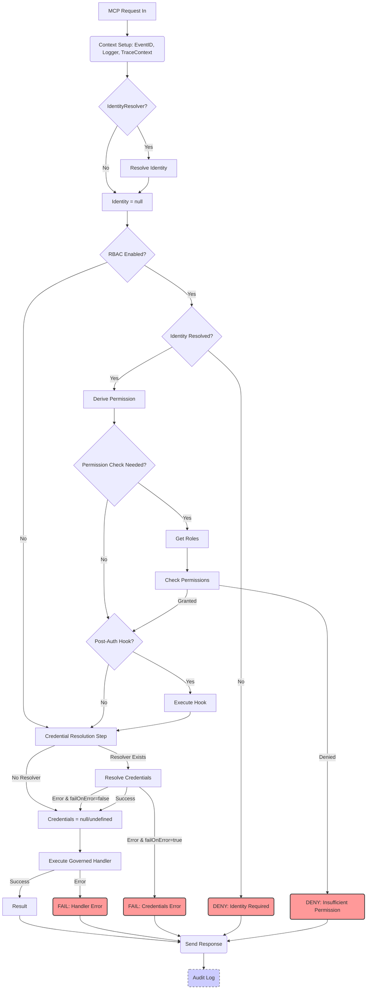

# MCP Governance SDK (@ithena/mcp-governance)

[](https://www.npmjs.com/package/@ithena/mcp-governance)
[](https://opensource.org/licenses/MIT)
<!-- [](https://github.com/ithena-labs/mcp-governance/actions/workflows/ci.yml) -->
<!-- Add build status badge once CI is set up -->

**The missing governance layer for your Model Context Protocol (MCP) servers.**

Build secure, compliant, and observable MCP applications by easily adding **Identity, Authorization (RBAC), Credential Management, Auditing, Logging, and Tracing** to servers built with [`@modelcontextprotocol/sdk`](https://github.com/modelcontextprotocol/typescript-sdk).

---

## The Problem: Production MCP Needs More

The standard [`@modelcontextprotocol/sdk`](https://github.com/modelcontextprotocol/typescript-sdk) is excellent for implementing the core MCP communication protocol. However, deploying MCP servers in production, especially in enterprise environments, requires addressing critical governance questions:

*   ❓ **Who** is accessing data and tools? (Authentication)
*   🔒 Are they **allowed** to do that? (Authorization)
*   🔑 How do handlers securely access needed **secrets**? (Credentials)
*   📝 **What happened**? (Auditing & Compliance)
*   🩺 How do we **monitor and debug** effectively? (Logging & Tracing)

Implementing these consistently across every MCP server is complex and error-prone.

## The Solution: `@ithena/mcp-governance`

This SDK provides a standard, pluggable framework that wraps the base `Server` class, letting you integrate essential governance features without rewriting your core MCP logic.

**Benefits:**

*   ✅ **Standardize Governance:** Consistent handling of identity, permissions, secrets, and auditing.
*   🔒 **Enhance Security:** Enforce access controls and securely manage credentials.
*   📝 **Meet Compliance:** Generate detailed audit trails for regulatory requirements.
*   🧩 **Pluggable Architecture:** Integrate easily with your existing enterprise systems (IDPs, Secret Managers, SIEMs) via well-defined interfaces.
*   ⚙️ **Focus on Business Logic:** Let the SDK handle governance boilerplate, allowing your team to focus on building valuable MCP resources, tools, and prompts.
*   🚀 **Faster Development:** Get production-ready features out-of-the-box with sensible defaults for development and testing.

## Key Features

*   🆔 **Pluggable Identity Resolution** (`IdentityResolver`)
*   🛡️ **Flexible Role-Based Access Control** (`RoleStore`, `PermissionStore`)
*   🔑 **Secure Credential Injection** (`CredentialResolver`)
*   ✍️ **Comprehensive Auditing** (`AuditLogStore`)
*   🪵 **Structured, Request-Scoped Logging** (`Logger`)
*   🔗 **Trace Context Propagation** (W3C default via `TraceContextProvider`)
*   ⚙️ **Configurable Governance Pipeline**
*   📦 **Minimal Intrusion** (Wraps the base SDK `Server`)

## Architecture Overview

`@ithena/mcp-governance` intercepts incoming MCP requests and notifications, processing them through a defined pipeline before (or during) the execution of your business logic handlers.

**Request Processing Pipeline:**



*   Errors during Identity, RBAC, Post-Auth Hook (if configured to fail), or Credential Resolution (if configured to fail) typically prevent handler execution and result in an error response.
*   Notifications follow a simpler path (Context -> Identity -> Handler -> Audit).
*   Auditing occurs at the end, capturing the entire operation's outcome.

## Installation

```bash
npm install @ithena/mcp-governance @modelcontextprotocol/sdk zod
# or
yarn add @ithena/mcp-governance @modelcontextprotocol/sdk zod
```

**Peer Dependencies:** Make sure you have compatible versions of `@modelcontextprotocol/sdk` (check `peerDependencies` in `package.json`) and `zod` installed.

## Quick Start

This example demonstrates wrapping a base MCP server, adding simple identity resolution (via a hardcoded header), RBAC using in-memory stores, and console logging/auditing.

```typescript
import { Server as BaseServer } from '@modelcontextprotocol/sdk/server';
import { StdioServerTransport } from '@modelcontextprotocol/sdk/server/stdio';
import { Request, Result } from '@modelcontextprotocol/sdk'; // Import base types
import {
    GovernedServer,
    ConsoleLogger,           // Default structured logger
    ConsoleAuditLogStore,    // Default audit store (logs to console)
    InMemoryRoleStore,       // Default in-memory RBAC store
    InMemoryPermissionStore, // Default in-memory RBAC store
    IdentityResolver,        // Interface for identity
    OperationContext,
    UserIdentity,
    GovernedRequestHandlerExtra
} from '@ithena/mcp-governance';
import { z } from 'zod'; // Peer dependency

// --- 1. Create Base MCP Server ---
const baseServer = new BaseServer({ name: "MyGovernedServer", version: "1.0.0" });

// --- 2. Configure Governance Components ---
const logger = new ConsoleLogger({}, 'debug'); // Log debug messages and above
const auditStore = new ConsoleAuditLogStore();

// Configure RBAC (In-memory example - NOT FOR PRODUCTION)
const roleStore = new InMemoryRoleStore({
    'user-admin': ['admin'],
    'user-viewer': ['viewer'],
});
const permissionStore = new InMemoryPermissionStore({
    'admin': ['tool:call:admin_tool', 'resource:read:*'],
    'viewer': ['resource:read:public/*'],
});

// Simple Identity Resolver (Example: trusts a header)
// !! Replace with real authentication logic (JWT, OAuth introspection, etc.) !!
const identityResolver: IdentityResolver = {
    async resolveIdentity(opCtx: OperationContext): Promise<UserIdentity | null> {
        const userHeader = opCtx.transportContext.headers?.['x-user-id'];
        const userId = Array.isArray(userHeader) ? userHeader[0] : userHeader;
        return userId || null; // Return string or null
    }
};

// --- 3. Create GovernedServer ---
const governedServer = new GovernedServer(baseServer, {
    logger: logger,
    auditStore: auditStore,
    identityResolver: identityResolver,
    roleStore: roleStore,
    permissionStore: permissionStore,
    enableRbac: true, // Enable RBAC checks
    auditDeniedRequests: true,
    serviceIdentifier: "my-mcp-service-instance-1",
});

// --- 4. Register Handlers via GovernedServer ---
// Zod schema for the admin tool request
const adminToolSchema = z.object({
    method: z.literal('tools/call'),
    params: z.object({ name: z.literal('admin_tool'), args: z.any().optional() }).passthrough() // Allow _meta etc.
}).passthrough();

governedServer.setRequestHandler(adminToolSchema,
    async (request, extra) => {
        extra.logger.info(`Executing admin_tool for identity: ${extra.identity}`);
        return { content: [{ type: 'text', text: `Admin operation successful for ${extra.identity}` }] };
    }
);

// Zod schema for resource read requests
const resourceReadSchema = z.object({
    method: z.literal('resources/read'),
    params: z.object({ uri: z.string() }).passthrough()
}).passthrough();

governedServer.setRequestHandler(resourceReadSchema,
    async (request, extra) => {
         extra.logger.info(`Reading resource ${request.params.uri} for ${extra.identity}`);
         if (request.params.uri.startsWith('secret/')) {
             // Example check (RBAC should handle this ideally)
             if (!extra.roles?.includes('admin')) {
                 throw new Error("Simulated internal access denied by handler");
             }
         }
        return { contents: [{ uri: request.params.uri, text: `Content of ${request.params.uri}` }] };
     }
);

// --- 5. Connect Transport ---
const transport = new StdioServerTransport();
await governedServer.connect(transport);

logger.info("Governed MCP server started on stdio.");
logger.info("Send requests via an MCP client.");

// --- Graceful Shutdown ---
const shutdown = async () => {
    logger.info("Shutting down...");
    await governedServer.close();
    logger.info("Shutdown complete.");
    process.exit(0);
};
process.on('SIGINT', shutdown);
process.on('SIGTERM', shutdown);
```

## Core Concepts & Interfaces

Implement these interfaces to integrate `@ithena/mcp-governance` with your infrastructure:

*   **`GovernedServer`**: The main wrapper class. You configure it with your components and register your MCP handlers (tool, resource, prompt) with it.
*   **`IdentityResolver`**: (`src/interfaces/identity.ts`) Determines the `UserIdentity` (who the caller is) from the request context (headers, tokens, etc.).
*   **`RoleStore`**: (`src/interfaces/rbac.ts`) Fetches the list of roles associated with a resolved `UserIdentity`.
*   **`PermissionStore`**: (`src/interfaces/rbac.ts`) Checks if a specific role grants a given permission string (e.g., `tool:call:my_tool`).
*   **`CredentialResolver`**: (`src/interfaces/credentials.ts`) Securely fetches secrets (API keys, DB passwords) needed by your handlers, based on context or identity.
*   **`AuditLogStore`**: (`src/interfaces/audit.ts`) Receives detailed `AuditRecord` objects for logging to your SIEM or logging platform.
*   **`Logger`**: (`src/interfaces/logger.ts`) Interface for structured logging. Provide your own adapter (Pino, Winston, etc.) or use the default.
*   **`TraceContextProvider`**: (`src/interfaces/tracing.ts`) Extracts distributed tracing IDs (like W3C `traceparent`) from request context.

## Configuration (`GovernedServerOptions`)

Customize the behavior by passing options to the `GovernedServer` constructor:

| Option                          | Type                                                            | Default                     | Description                                                                 |
| :------------------------------ | :-------------------------------------------------------------- | :-------------------------- | :-------------------------------------------------------------------------- |
| `identityResolver`              | `IdentityResolver`                                              | `undefined`                 | **Required for RBAC**. Your logic to identify the user.                   |
| `roleStore`                     | `RoleStore`                                                     | `undefined`                 | **Required for RBAC**. Fetches roles for an identity.                       |
| `permissionStore`               | `PermissionStore`                                               | `undefined`                 | **Required for RBAC**. Checks if a role has a permission.                 |
| `credentialResolver`            | `CredentialResolver`                                            | `undefined`                 | Fetches secrets for handlers.                                               |
| `auditStore`                    | `AuditLogStore`                                                 | `NoOpAuditLogStore`         | Where to send audit logs.                                                   |
| `logger`                        | `Logger`                                                        | `ConsoleLogger`             | Structured logger instance.                                                 |
| `traceContextProvider`          | `TraceContextProvider`                                          | `defaultTraceContextProvider` | Extracts trace IDs (e.g., from `traceparent` header).                     |
| `enableRbac`                    | `boolean`                                                       | `false`                     | If true, performs RBAC checks using stores.                                 |
| `failOnCredentialResolutionError` | `boolean`                                                       | `true`                      | If true, requests fail if `credentialResolver` throws an error.           |
| `auditDeniedRequests`           | `boolean`                                                       | `true`                      | If true, logs audit records even for requests denied by RBAC.             |
| `auditNotifications`            | `boolean`                                                       | `false`                     | If true, logs audit records for incoming notifications.                     |
| `derivePermission`              | `(req, ctx) => string \| null`                                  | `defaultDerivePermission`   | Function to generate the permission string for a request.                 |
| `sanitizeForAudit`              | `(record) => record`                                            | `defaultSanitizeForAudit`   | Function to mask/remove sensitive data before logging audit records.      |
| `postAuthorizationHook`         | `(identity, opCtx) => Promise<void>`                            | `undefined`                 | Optional async function called after successful authorization.            |
| `serviceIdentifier`             | `string`                                                        | `undefined`                 | Optional identifier for this service instance included in logs/audits. |

## Default Implementations

Defaults are provided for easy setup and development (**replace for production** where appropriate):

*   `ConsoleLogger`: Logs JSON to `console`.
*   `NoOpAuditLogStore`/`ConsoleAuditLogStore`: Disables auditing or logs JSON to `console`.
*   `InMemoryRoleStore`/`InMemoryPermissionStore`: Simple in-memory stores for testing RBAC.
*   `defaultTraceContextProvider`: Handles W3C `traceparent`/`tracestate` headers.
*   `defaultDerivePermission`: Creates basic permission strings (e.g., `tool:call:<name>`).
*   `defaultSanitizeForAudit`: Basic masking of common credential patterns. **Review carefully!**

## Security Considerations

*   🛡️ **Implement Secure Components:** The security of your system relies heavily on your implementations of `IdentityResolver`, `RoleStore`, `PermissionStore`, and `CredentialResolver`. Validate all inputs rigorously.
*   🔑 **Authentication:** This SDK *facilitates* identity use but *does not perform authentication*. Your `IdentityResolver` must securely validate credentials (tokens, keys, sessions) provided by the transport layer (e.g., headers).
*   ✍️ **Audit Sanitization:** The default audit sanitizer is basic. **You MUST review and likely customize `sanitizeForAudit`** to prevent sensitive data (PII, secrets specific to your domain) from leaking into logs.
*   ⚙️ **Input Validation:** Use Zod schemas with `setRequestHandler`/`setNotificationHandler` and validate any inputs used within your custom governance components.
*   🚫 **Error Messages:** Configure error handling to avoid leaking excessive internal details in responses sent to clients.

## Contributing

Contributions are welcome! Please open an issue or submit a pull request on the [GitHub repository](https://github.com/ithena-labs/mcp-governance). <!-- Update URL -->

## License

This project is licensed under the MIT License. See the [LICENSE](LICENSE) file for details.
